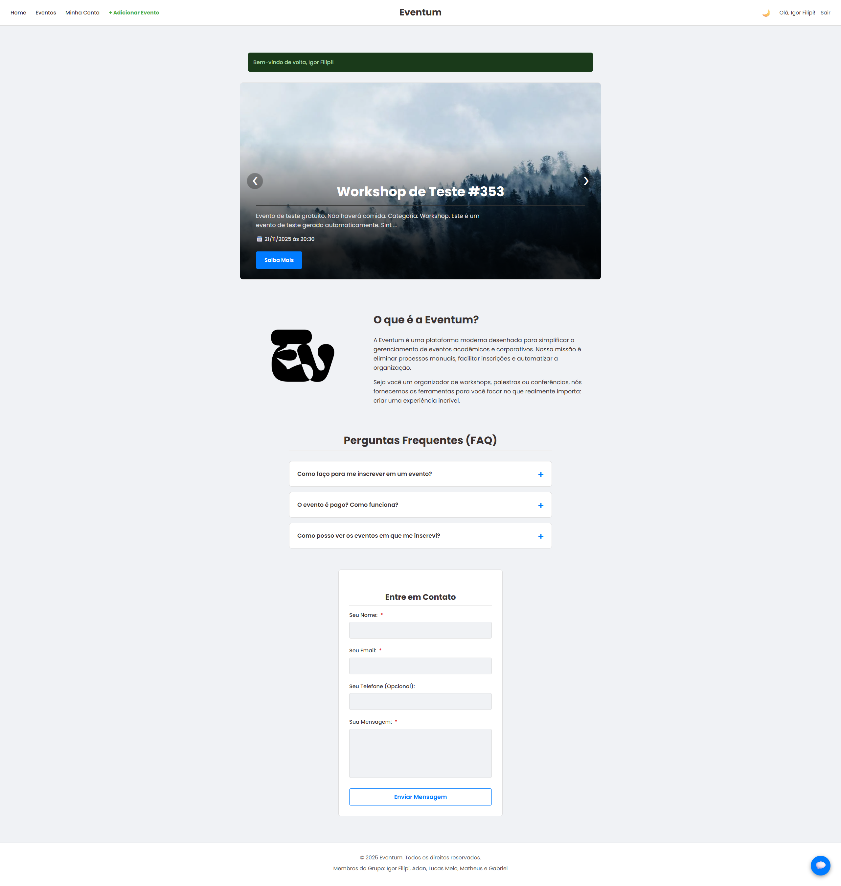
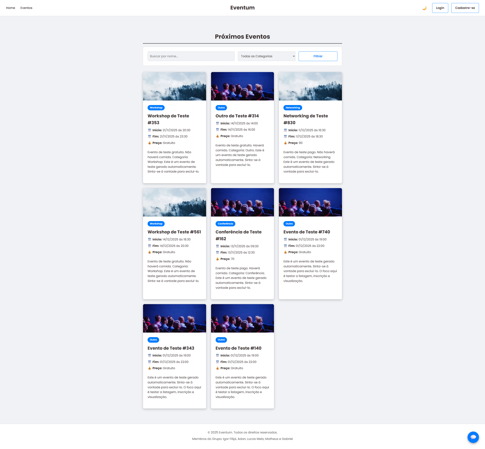

# 🚀 Eventum Platform: De API Simples a Plataforma Full Stack de Eventos

<p align="center">
  
</p>

[]()
[]()
[]()
[]()

Este projeto representa uma **transformação completa**. Partindo de um **backend REST mínimo** (com as rotas de usuários e eventos básicas) desenvolvido por um colega: [@Matheus-Hen], a aplicação evoluiu para uma **Plataforma Full Stack robusta, segura e focada em UX**, com todas as camadas de frontend, segurança avançada e funcionalidades administrativas construídas por mim.

O foco foi transformar um simples "serviço de dados" em um **produto coeso e funcional**.

---

## 📈 A Engenharia de Valor Agregado

| Área | API Base (Trabalho Anterior) | Plataforma Final (Minha Contribuição) |
| :--- | :--- | :--- |
| **Arquitetura** | Apenas Express e SQLite. | **Stack Full Stack (Express + EJS)**, com organização de rotas (Site/Admin) e middlewares de segurança. |
| **Interface & UX** | Sem interface (Apenas cURL). | **Interface Web Completa** (HTML/CSS/JS, Tema Claro/Escuro, Carrossel, Abas, Chat). |
| **Segurança** | Sem autenticação ou autorização. | **Autenticação Completa** (bcrypt/Sessão) e **Autorização Admin/User**. |
| **Dados** | CRUD simples e campos limitados. | **Expansão do DB** com 10 novos campos/JSONs complexos (Atrações, Cronograma, Endereço). |
| **Funcionalidades** | Apenas listar/cadastrar. | **Geração de Certificados em PDF**, **Upload de Mídia (Multer)**, Relatórios Gerenciais e Formulário de 5 Etapas. |

---

## 💎 Recursos de Destaque da Plataforma

### 1. 👑 Área Administrativa (Gerencial e Automação)

* **Relatórios e PDF:** Implementação do **PDFKit** para gerar **Certificados de Participação** por evento e relatórios gerenciais de Receita Estimada e Estatísticas.
* **Gestão de Conteúdo Profissional:** Integração do **Multer** para *upload* de imagens de capa, oferecendo ao Admin total controle sobre a mídia do evento.
* **Formulário Stepper:** Criação de um formulário de evento dividido em 5 etapas, utilizando lógica JavaScript para serializar dados dinâmicos (Palestrantes/Artistas) em JSON antes de salvar no banco.

### 2. 🔐 Segurança e User Experience (UX)

* **Controle de Sessão e Acesso:** Uso de middlewares para proteger rotas (`isAdmin`, `isLoggedIn`), garantindo que apenas usuários logados (e com a *role* correta) possam acessar recursos.
* **Privacidade do Usuário:** Implementação de recursos cruciais como troca de senha segura e a **rota de Deleção de Conta** completa.
* **Design e Interação:**
    * Design **Tema Escuro/Claro** persistente no navegador.
    * Máscaras de input (CPF) e campos de perfil detalhados (Nome Completo, Gênero).

### 3. 💸 Lógica de Inscrição Avançada

* **Validação Robusta:** Lógica aprimorada para lidar com eventos lotados e impedir inscrições duplicadas (`UNIQUE`).
* **Suporte a Pagamentos:** Simulação de fluxo de pagamento para eventos pagos, ajustando a mensagem de sucesso para refletir a confirmação da transação.

---

## 📸 Visuais do Projeto

### Home Page e Carrossel (Administrativo)



### Painel Eventos



---

## ⚙️ Como Rodar o Projeto

### Pré-requisitos

* Node.js 16+
* npm

### Instalação

1.  Clone o repositório.
2.  Instale as dependências:
    ```bash
    npm install
    ```

### Execução

Utilize o script `dev` para um início rápido em ambiente de desenvolvimento:

```bash
npm run dev
